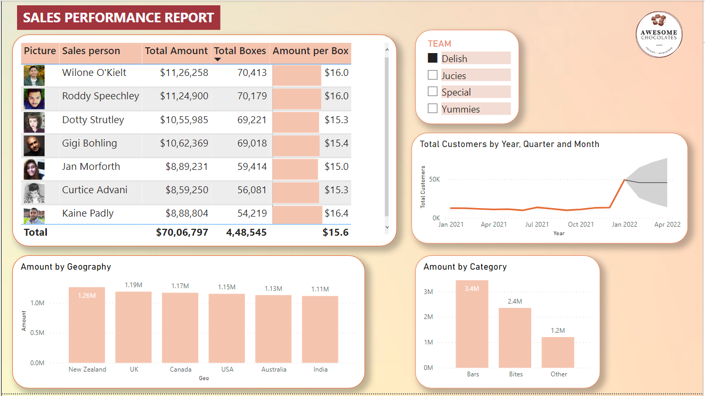
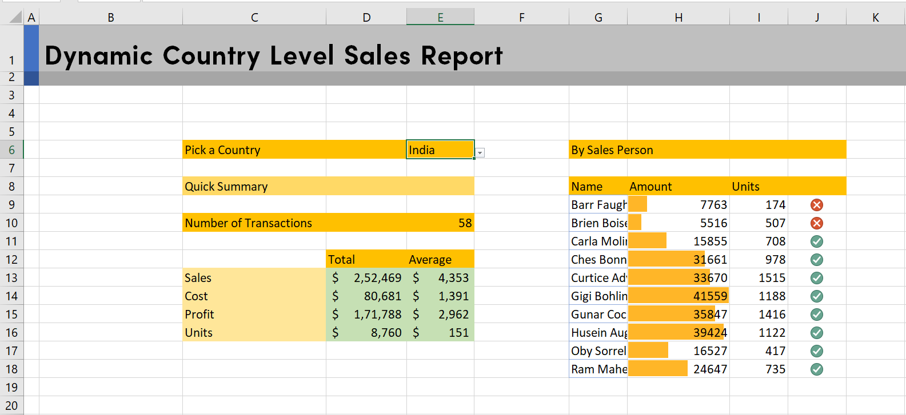

# Awesome Chocolates - Sales Insights (Data Cleaning, EDA using Excel and Dashboard)

This project includes buiding *Sales Insights Report* of Awesome Chocolates Company, by cleaning data in MS-Excel, EDA with Conditional Formatting, Pivot Tables and Charts and building a Dashboard in PowerBI.

- *Collecting Sales Revenue Data* - of Awesome Chocolates Company.
- *Cleaning the Data Set* - using Excel functions (removing/replacing null values, dropping unnecessary columns, renaming columns to make sense to the reader)
- *Exploratory Data Analysis (EDA)* - 
    - Finding Total Sales Revenue and Profit made by company.
    - Finding Top Selling Products
    - Finding Products to discontinue
    - Finding Sales by Country and many other analysis.
    - Building Charts and Plots and *Pivot Tables* in Excel
- *Building a stunning Dashboard* - using *PowerBI* to showcase the Sales Insights of the company.

## Dashboard

### Dynamic Sales Report in MS-Excel (Pivot Table)

